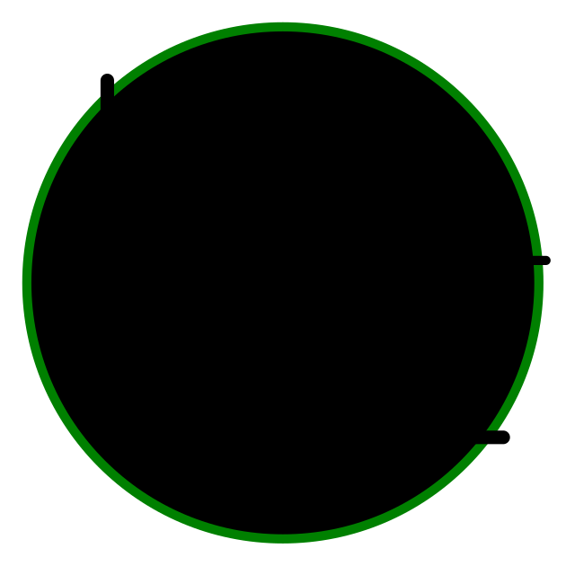

    

# [MathJSLab](https://mathjslab.com/) - [mathjslab.com](https://mathjslab.com/)

> Un [intérprete](https://es.wikipedia.org/wiki/Int%C3%A9rprete_(inform%C3%A1tica)) con sintaxis de lenguaje como [MATLAB&reg;](https://www.mathworks.com/)/[Octave](https://www.gnu.org/software/octave/) escrito en [TypeScript](https://www.typescriptlang.org/).

La [**Organización MathJSLab**](https://github.com/MathJSLab) fue creada para reunir los [repositorios](https://github.com/orgs/MathJSLab/repositories) del [Proyecto MathJSLab] (https://mathjslab.com/).

Copyright &copy; 2016-2024 [Sergio Lindau](mailto:sergiolindau@gmail.com), 

[mathjslab.com](https://mathjslab.com/), [mathjslab@gmail.com](mailto:mathjslab@gmail.com).

