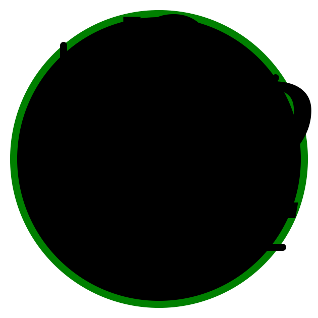

<p align="center">
<a href="https://mathjslab.com/" target="_blank" rel="noopener"></a>
</p>

# [MathJSLab](https://mathjslab.com/) - [mathjslab.com](https://mathjslab.com/)

[](README.md) [](LEIAME.md) [](LEAME.md)

[](https://mathjslab.com/) [](https://mathjslab.com/) [](https://github.com/MathJSLab/.github) [](https://github.com/MathJSLab/mathjslab/blob/main/LICENSE) [](https://explore.openaire.eu/search/advanced/research-outcomes?f0=q&fv0=MathJSLab)

> An [interpreter](<https://en.wikipedia.org/wiki/Interpreter_(computing)>) with language syntax like [MATLAB&reg;](https://www.mathworks.com/)/[Octave](https://www.gnu.org/software/octave/) written in [TypeScript](https://www.typescriptlang.org/).

The **[MathJSLab Organization](https://github.com/MathJSLab)** was created to bring together the [MathJSLab Project](https://mathjslab.com/) [repositories](https://github.com/orgs/MathJSLab/repositories).

**Important Notice:** This software, the **[MathJSLab](https://mathjslab.com/), is not affiliated, sponsored, or endorsed by [The MathWorks, Inc.](https://www.mathworks.com/)** [MATLAB&reg;](https://www.mathworks.com/products/matlab.html) is a registered trademark of [The MathWorks, Inc.](https://www.mathworks.com/) For more information about [MATLAB](https://www.mathworks.com/products/matlab.html), visit [www.mathworks.com](https://www.mathworks.com/).

This organization owns:

- The organization profile [repository](https://github.com/MathJSLab/.github).
- The [npm package](https://www.npmjs.com/package/mathjslab) [repository](https://github.com/MathJSLab/mathjslab).
- The [demo web application](https://app.mathjslab.com) [repository](https://github.com/MathJSLab/mathjslab-app).
- The [project page](https://mathjslab.com) [repository](https://github.com/MathJSLab/mathjslab-www).

All relevant actions of this organization are recorded in our [logbook](../LOGBOOK.md).

The overall design guidelines for the project, the roadmap for next steps, research, and other relevant information are stored in the [`roadmap`](https://github.com/MathJSLab/.github/tree/main/roadmap) directory.

To clone all of the [organization's repositories](https://github.com/orgs/MathJSLab/repositories) locally, create a directory called `mathjslab-repositories` and save the file [`mathjslab.package.json`](https://github.com/MathJSLab/.github/blob/main/mathjslab.package.json) in it with the name `package.json`. The scripts in this file clone all of the [**MathJSLab Organization**'s repositories](https://github.com/orgs/MathJSLab/repositories), creating a complete workspace locally. This file also contains additional build scripts for the individual projects. Run the following commands:

```bash
mkdir mathjslab-repositories
cd mathjslab-repositories
curl -k -o ./package.json https://raw.githubusercontent.com/MathJSLab/.github/refs/heads/main/mathjslab.package.json
npm run all:clone:all
```

Copyright &copy; 2016-2025 [Sergio Lindau](mailto:sergiolindau@gmail.com), [](https://orcid.org/0009-0006-9115-0291)

[mathjslab.com](https://mathjslab.com/), [mathjslab@gmail.com](mailto:mathjslab@gmail.com).

[](https://grp.isbn-international.org/search/piid_solr?keys=978-65-00-82338-7) [](https://doi.org/10.5281/zenodo.8396265)

[](https://grp.isbn-international.org/search/piid_solr?keys=978-65-00-84828-1) [](https://doi.org/10.5281/zenodo.8396263)

This organization profile was last modified on 2025-10-17.
